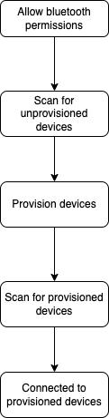
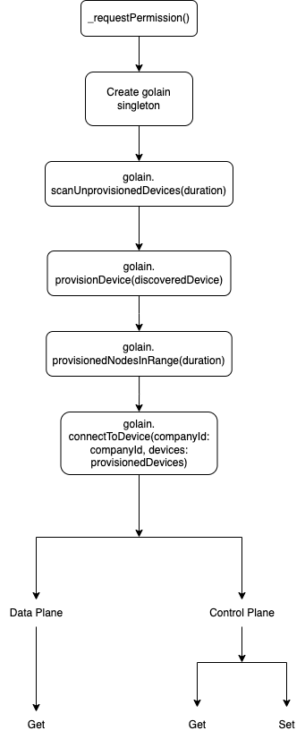

# WIP
### Expected Functionality and Features

#### Top level features BLE Mesh

- [x] Scan for nearby BLE devices
- [x] Connect to a BLE device
- [x] Provision a BLE device
- [x] Add a BLE device to a Mesh Network
- [ ] Remove devices from network (deprovision)
- [ ] Bulk Provisioning of BLE devices
- [ ] Identify devices being provisioned / deprovisioned
- [x] Send and receive data from a BLE device
- [ ] Send and receive data from multiple BLE devices simlutaneously (purely through groups)
- [ ] Groups support for sending and receiving data from multiple BLE devices

#### Code level BLE Mesh features for developer health
- [ ] APIs for listing nearby BLE devices
`GolainMeshManager.getProvisionedDevices(callback: (result: Result<List<?????>, GolainError>) -> Unit)`
`GolainMeshManager.getConnectedDevices(callback: (result: Result<List<ProvisionedNode>, GolainError>) -> Unit)`
- [ ] APIs for deprovisioning
`GolainMeshManager.deprovisionDevice(deviceId: String, callback: (result: Result<String, GolainError>) -> Unit)`
- [ ] APIs for bulk provisioning
`GolainMeshManager.bulkProvisionDevices(devices: List<DiscoveredDevice>, callback: (result: Result<String, GolainError>) -> Unit)`
- [ ] APIs for identifying devices being provisioned / deprovisioned
`GolainMeshManager.identifyDevice(device: DiscoveredDevice, callback: (result: Result<String, GolainError>) -> Unit)`
- [ ] APIs for groups support for sending and receiving data from multiple BLE devices
`GolainMeshManager.createGroup(groupName: String, callback: (result: Result<String, GolainError>) -> Unit)`
`GolainMeshManager.addDevicesToGroup(deviceId: List<ProvisionedNode>, groupName: String, callback: (result: Result<String, GolainError>) -> Unit)`
`GolainMeshManager.removeDeviceFromGroup(device: ProvisionedNode, groupName: String, callback: (result: Result<String, GolainError>) -> Unit)`
`GolainMeshManager.deleteGroup(groupName: String, callback: (result: Result<String, GolainError>) -> Unit)`
`GolainMeshManager.sendDataToGroup(groupName: String, data: List<Uint8>, callback: (result: Result<String, GolainError>) -> Unit)`


# Golain Mobile Plugin

### What are Low energy Bluetooth Mesh Devices?
Low Energy Bluetooth devices, also known as Bluetooth Low Energy (BLE) or Bluetooth Smart, are a type of wireless communication technology that allows devices to transmit and receive data with minimal power consumption. They are designed to enable devices to operate on a single coin cell battery for months or even years without needing to be replaced.

BLE devices are typically used for applications that require low-power, intermittent data transfer, such as fitness trackers, smartwatches, and medical devices. They are also commonly used in Internet of Things (IoT) applications, where they can be used to connect a wide range of devices and sensors to the internet.


### What is Bluetooth Mesh?

Bluetooth Mesh is a networking topology that extends the capabilities of traditional Bluetooth wireless technology. While traditional Bluetooth is a point-to-point or point-to-multipoint technology that connects devices directly to one another, Bluetooth Mesh enables many-to-many communications, allowing multiple devices to communicate with one another in a decentralized network.

- Each node in the network can communicate with any other node, regardless of whether it is within range or not. This is possible because the messages sent between nodes are relayed through other nodes in the network, creating a mesh-like structure.
- Bluetooth Mesh also supports a wide range of device types and use cases, from low-power sensors to high-bandwidth audio and video streaming. 
- With support for security features such as encryption and authentication, Bluetooth Mesh networks can also be used to transmit sensitive data securely.

### How to connect a BLE device and add it to a Mesh Network?

**1. Scanning**:
    Use a mobile app or other software that supports BLE scanning to search for nearby BLE devices. This involves sending out scan requests and listening for advertising packets broadcast by BLE devices in the area.


**2. Provisioning**: 
   Once a nearby BLE device is identified, the next step is to provision it for use in the network. This involves configuring the device with a unique identifier, security keys, and other network-specific information. Provisioning can be done through the device's configuration interface or by sending commands over the BLE connection.

**3. Connecting**:
 Once the device is provisioned, you can establish a connection with it using the unique identifier that was assigned during provisioning. This involves sending connection requests and receiving connection responses from the device.

**4. Authentication**: 
   After the connection is established, the device and the network must authenticate each other to ensure that they are authorized to communicate with each other. This can involve exchanging security keys.

**5. Adding to the network**:
 Once the device is authenticated, it can be added to the network. This involves assigning the device to a specific role in the network, such as a sensor or actuator, and configuring it to communicate with other devices on the network.

**6. Data transfer**:
 Once the device is added to the network, it can begin sending and receiving data with other devices on the network. This can involve using a variety of different data transfer mechanisms, such as notifications, indications, or read/write operations.

### How does data transfer work in Bluetooth Mesh?
In Bluetooth Mesh, data transfer works through a multi-hop communication process, where multiple nodes (devices) in the network collaborate to send data packets to their destination.

When a node wants to send data to another node in the network, it first broadcasts the data packet to all of its neighboring nodes. Each neighboring node that receives the packet re-broadcasts it to its own neighboring nodes until the packet reaches its destination. This process is known as a "mesh" because each node acts as a relay for the data packet, forming a web of interconnected nodes that collaborate to transfer the data.

To ensure reliable data transfer, each node keeps track of the packets it sends and receives and uses acknowledgments and retransmissions to recover from any lost packets. The Bluetooth Mesh protocol also supports encryption and authentication to ensure that data is kept confidential and that only authorized devices can access the network.

The Bluetooth Mesh protocol defines several different types of messages that nodes can use to communicate with each other, such as "control messages" that are used to set up and manage the network, and "access messages" that are used to send application-specific data. These messages are encapsulated in packets that are transmitted over the network using a variety of different mechanisms, such as advertising packets, network beacons, and data messages.



### What is a Vendor model?
In BLE networking, a vendor model is a custom model that is not defined by the Bluetooth SIG but rather by a specific vendor. It allows vendors to create their own custom functionality on top of the standard Bluetooth mesh networking specification. The vendor model provides a way for vendors to differentiate their products and offer unique features and capabilities. However, because vendor models are not standardized, they are not guaranteed to be interoperable with other vendor products.

#### About the Golain Vendor Model

The Golain Vendor Model is a custom model that is not defined by the Bluetooth SIG but rather by Golain. It allows Golain to create their own custom functionality on top of the standard Bluetooth mesh networking specification. The Golain Vendor Model provides a way for Golain to differentiate their products and offer unique features and capabilities. However, because vendor models are not standardized, they are not guaranteed to be interoperable with other vendor products.

### How does data transfer work using Golain Vendor Model?
Bluetooth Mesh networking has two main planes: the control plane and the data plane.

The **control plane** is responsible for managing the network topology and node configuration. It uses messages called configuration messages to set up, manage, and monitor the network. These messages are typically sent between nodes using the publish/subscribe model, and they are relayed by intermediate nodes to reach their destination.

The **data plane** is responsible for transmitting user data between nodes. It uses messages called access messages to send data between nodes. Access messages are typically sent directly between nodes, and they are not relayed by intermediate nodes.

### What is Bluetooth Mesh SDK?

Bluetooth Mesh SDK is a software development kit that allows developers to create Bluetooth Mesh applications for Android and iOS devices. The SDK provides a set of APIs that allow developers to create Bluetooth Mesh networks, provision and configure devices, and send and receive messages.

## How to install the Golain Mobile Plugin?

1. Go to the pubspec.yaml file of your project and add the following line to the dependencies section:

```yaml
#Golain BLE Mesh Plugin
  golain:
    git:
      url: https://github.com/golain-io/golain-mobile-shell.git
      ref: main
``` 

### Android

2. Go to the android/settings.gradle file of your project and add the following lines to the dependencies section:

``` dart
    // reuse app_plugin_loader.gradle code to include nested Android-nRF-Mesh-Library without hard-coding the directory path

    import groovy.json.JsonSlurper

    def flutterProjectRoot = rootProject.projectDir.parentFile

    // Note: if this logic is changed, also change the logic in module_plugin_loader.gradle.
    def pluginsFile = new File(flutterProjectRoot, '.flutter-plugins-dependencies')
    if (!pluginsFile.exists()) {
    return
    }

    def object = new JsonSlurper().parseText(pluginsFile.text)
    assert object instanceof Map
    assert object.plugins instanceof Map
    assert object.plugins.android instanceof List
    // Includes the Flutter plugins that support the Android platform.
    object.plugins.android.each { androidPlugin ->
    assert androidPlugin.name instanceof String
    assert androidPlugin.path instanceof String
    if(androidPlugin.name == 'nordic_nrf_mesh'){
        println 'should include forked Nordic\'s ADK v3'
        def meshLibPath = androidPlugin.path.replace('android', '') + 'Android-nRF-Mesh-Library-1\\mesh\\'
        println 'meshLibPath = ' + meshLibPath
        include ':mesh'
        project(':mesh').projectDir = file(meshLibPath)
    }
    }
``` 

3. Go to the android/app/build.gradle file of your project and set the following:

```gradle
    defaultConfig {
        minSdkVersion 23
    }
```

### iOS

4. Replace the ios/Podfile with following code.

```Pod
# Uncomment this line to define a global platform for your project
platform :ios, '12.0'

# CocoaPods analytics sends network stats synchronously affecting flutter build latency.
ENV['COCOAPODS_DISABLE_STATS'] = 'true'

project 'Runner', {
  'Debug' => :debug,
  'Profile' => :release,
  'Release' => :release,
}

def flutter_root
  generated_xcode_build_settings_path = File.expand_path(File.join('..', 'Flutter', 'Generated.xcconfig'), __FILE__)
  unless File.exist?(generated_xcode_build_settings_path)
    raise "#{generated_xcode_build_settings_path} must exist. If you're running pod install manually, make sure flutter pub get is executed first"
  end

  File.foreach(generated_xcode_build_settings_path) do |line|
    matches = line.match(/FLUTTER_ROOT\=(.*)/)
    return matches[1].strip if matches
  end
  raise "FLUTTER_ROOT not found in #{generated_xcode_build_settings_path}. Try deleting Generated.xcconfig, then run flutter pub get"
end

require File.expand_path(File.join('packages', 'flutter_tools', 'bin', 'podhelper'), flutter_root)

flutter_ios_podfile_setup

target 'Runner' do
  use_frameworks!
  use_modular_headers!
  #using static library linkage (to be able to use nRFMeshProvision when it is a git submodule of nrf_mesh_plugin)
  use_frameworks! :linkage => :static
  pod 'nRFMeshProvision', :path => '.symlinks/plugins/nordic_nrf_mesh/IOS-nRF-Mesh-Library'
  flutter_install_all_ios_pods File.dirname(File.realpath(__FILE__))
end

post_install do |installer|
  installer.pods_project.targets.each do |target|
    flutter_additional_ios_build_settings(target)
    target.build_configurations.each do |config|
      config.build_settings['GCC_PREPROCESSOR_DEFINITIONS'] ||= [
        '$(inherited)',
        'PERMISSION_BLUETOOTH=1',
      ]
    end
  end
end
```

### What is Nordic NRF Mesh Library and Flutter BLE Reactive?

**The Nordic nRF Mesh library** is a software development kit (SDK) provided by Nordic Semiconductor that allows developers to create Bluetooth Mesh network applications for Nordic Semiconductor's nRF52 and nRF51 series of Bluetooth Low Energy (BLE) SoCs (System on Chips). The nRF Mesh library includes a range of Bluetooth Mesh models, examples, and tools to help developers create custom Bluetooth Mesh applications using the nRF52/nRF51 SoCs. The library is available for free download from Nordic Semiconductor's website and is released under a BSD license.

**Flutter Reactive BLE** is a library for the Flutter framework that provides an interface for communicating with BLE devices. Flutter is a popular open-source UI toolkit for building natively compiled applications for mobile, web, and desktop platforms. Reactive BLE is designed to simplify the process of communicating with BLE devices by providing a simple and reactive interface for discovering, connecting, and communicating with BLE devices. 
### What is the Golain Mobile Plugin?

The Golain Mobile Plugin is a wrapper around functions defined by the Nordic NRF Mesh Library and Flutter BLE Reactive library which provides a set of APIs that allow developers to create Bluetooth Mesh networks, provision and configure devices, and send and receive messages.

### Ask for bluetooth and location permission 

- Call a simple function in init method or onTap to check/ask for permission.  
- Use `permission_handler` and `device_info_plus` as additional dependencies in your `pubspec.yaml` file.


```dart
Future<void> _requestPermissions() async {
  if (defaultTargetPlatform == TargetPlatform.android) {
    final androidInfo = await DeviceInfoPlugin().androidInfo;
    if (androidInfo.version.sdkInt < 31) {
      await Permission.locationWhenInUse.request();
      await Permission.locationAlways.request();
      await Permission.bluetooth.request();
    } else {
      await Permission.bluetoothScan.request();
      await Permission.bluetoothConnect.request();
    }
  } else {
    await Permission.bluetooth.request();
  }
}
```

``` dart
// creating an object of the Golain class to access the functions defined in the class
// This is a singleton class
final Golain golain = Golain();
```

### I. Creating a Mesh network :

There are two primary ways to add a mesh network:


**1. Creating a new network**

Creating a mesh network involves configuring the network parameters, such as security keys and network name, and adding nodes to the network to communicate with each other.

**2. Loading an existing network**

Loading a mesh network involves provisioning a new device with the necessary network information to join an existing mesh network, establishing a secure connection with the network, and enabling the new device to communicate with other nodes.

Instantiating ```Golain``` class loads the mess network

**Note:** Keep resetting mesh network from time to time, otherwise the cache will not be able to store new node in the mesh network

```dart
golain.resetMeshNetwork();
```

### II. Scan for BLE devices 

Call ```scanUnprovisionedDevices()``` to scan for BLE devices that are not yet provisioned to a mesh network. This function returns a list of ```DiscoveredDevice``` objects that contain the name and ID of the BLE device.  
Pass the duration for the scanning of devices. 

```dart
golain.scanUnprovisionedDevices(Duration(seconds: 10)).listen((devices) {
      // do something with the devices
});
```

### III. Provision a device

Call ```provisionDevice()``` to provision a device to a mesh network. Pass the instance of ```DiscoveredDevice``` to the function. 


```dart
golain.provisionDevice(device);
```

### IV. Scan for provisioned devices

Call ```provisionedNodesInRange()``` to scan for BLE devices that are already provisioned to a mesh network. This function returns a list of ```DiscoveredDevice``` objects that contain the name and ID of the BLE device.

```dart
golain.provisionedNodesInRange(Duration(seconds: 10)).listen((devices) {
      // do something with the devices
});
```

### V. Connect to  device

Call ```connectToDevice()``` to connect to a provisioned device. Pass the list of ```DiscoveredDevice```s to the function and the company ID associated with the device. 

```dart
golain.connectToDevice(companyId: companyId, devices: provisionedDevices);
```

### VI. Use data plane for Vendor Model

Call ```dataPlaneGet``` to get data from the data plane in Golain Vendor Model. You need to pass the elementAddress of the node from which you want to get data from, pass the companyId, opcode to get from and pass the ```Uint8List``` data. The method returns ```VendorModelMessageData``` object which contains ```Uint8List``` message which can be decoded by suitable protobuf structure.

```dart
final vendorModelData = await golain.dataPlaneGet(
          companyId: companyId,
          elementAddress: elementAddress,
          data: Uint8List.fromList(data.codeUnits),
          opcode: dataGetOpCode,
        );
```

### VI. Use control plane for Vendor Model

The get call on control plane works similar to the one on data plane. For the set call you can get the Acknowledgement for the function in the response ```VendorModelMessageData```'s "message" parameter, you can decode it to String to read the message.

```dart
final vendorModelData = await golain.controlPlaneSet(
          companyId: companyId,
          elementAddress: elementAddress,
          data: .data,
          opcode: controlSetOpCode,
        );
```



# Internal documentation

#### I. Creating a Mesh network :

There are two primary ways to add a mesh network:


**1. Creating a new network**

Creating a mesh network involves configuring the network parameters, such as security keys and network name, and adding nodes to the network to communicate with each other.

**2. Loading an existing network**

Loading a mesh network involves provisioning a new device with the necessary network information to join an existing mesh network, establishing a secure connection with the network, and enabling the new device to communicate with other nodes.


```dart 
// This function loads an existing mesh network

 late final MeshManagerApi _meshManagerApi;

  Future<void> loadMeshNetwork() async {
    await _meshManagerApi.loadMeshNetwork();
  }
```

``` dart 
 
//This code sets the _meshNetwork variable to the current mesh network in the _meshManagerApi object, and subscribes to three events to update the _meshNetwork variable when the network is updated, imported, or loaded. These event listeners allow the application to stay in sync with the current state of the mesh network.

_meshManagerApi = _nordicNrfMesh.meshManagerApi;
    _meshNetwork = _meshManagerApi.meshNetwork;
    onNetworkUpdateSubscription =
        _meshManagerApi.onNetworkUpdated.listen((network) {
      _meshNetwork = network;
    });
    onNetworkImportSubscription =
        _meshManagerApi.onNetworkImported.listen((network) {
      _meshNetwork = network;
    });
    onNetworkLoadingSubscription =
        _meshManagerApi.onNetworkLoaded.listen((network) {
      _meshNetwork = network;
    });

```    

#### II. Scanning for unprovisioned Devices

1. This function scans for unprovisioned devices in the mesh network for a specified duration. It initializes a Set object to store the discovered devices, and a list devices to return the discovered devices. The _serviceData object is used to store the service data for each device.

2. The function cancels any existing scan subscription, clears the devices and _serviceData objects, and starts a new scan subscription. It listens to incoming devices and checks if they are already in the devices0 set. If not, it extracts the device UUID from the service data and adds the device to the devices0 set.

3. After the specified duration, the function cancels the scan subscription, sets isScanning to false, and returns the discovered devices as a List.

4. Overall, this function performs a Bluetooth scan for unprovisioned devices, stores the discovered devices and their service data, and returns the discovered devices after the specified scan duration.
    
``` dart

Future<List<DiscoveredDevice>> scanUnprovisionedDevices(
      {required Duration duration}) async {
    Set<DiscoveredDevice> devices0 = <DiscoveredDevice>{};
    List<DiscoveredDevice> devices = [];
    _serviceData.clear();
    _scanSubscription?.cancel();
    devices.clear();
    // ignore: await_only_futures
    _scanSubscription = await _nordicNrfMesh.scanForUnprovisionedNodes().listen(
      (device) async {
        isScanning = true;
        if (devices0.every((element) => element.id != device.id)) {
          final deviceUUid = Uuid.parse(_meshManagerApi.getDeviceUuid(
              device.serviceData[meshProvisioningUuid]!.toList()));
          _serviceData[device.id] = deviceUUid;
          devices0.add(device);
          devices = devices0.toList();
        }
      },
    );

    return Future.delayed(
      Duration(seconds: duration.inSeconds),
      () {
        isScanning = false;
        _scanSubscription?.cancel();
        return devices;
      },
    );
  }

  ```

#### III. Provisioning a Device
**Provisioning** is the process of adding a new, unprovisioned device to a Bluetooth mesh network, such as a light bulb. The process is managed by a provisioner. A provisioner and an unprovisioned device follow a fixed procedure which is defined in the Bluetooth mesh specification. A provisioner provides the unprovisioned device with provisioning data that allows it to become a Bluetooh mesh node.


This function provisions a Bluetooth device by extracting the device UUID and passing it to the provisioning() method of ``` _nordicNrfMesh ``` object. It first checks if the mesh network has been loaded and whether the app is already scanning or provisioning. It stops the scanning process if needed and throws an error or an exception if necessary. Finally, it awaits the completion of the provisioning process and updates the app state accordingly.

``` dart

Future<void> provisionDevice(DiscoveredDevice device) async {
    if (_meshNetwork == null) {
      return Future.error("Mesh Network not loaded");
    }

    if (isScanning) {
      await stopScanning();
    }
    if (isProvisioning) {
      throw Exception("Already Provisioning");
    }

    //not provisioning yet

    isProvisioning = true;

    try {
      String deviceUUID;

      if (Platform.isAndroid) {
        deviceUUID = _serviceData[device.id].toString();
      } else if (Platform.isIOS) {
        deviceUUID = device.id.toString();
      } else {
        throw UnimplementedError("Platform not supported");
      }

      final provisingEvent = ProvisioningEvent();
      final provisionedMeshNode = _nordicNrfMesh
          .provisioning(_meshManagerApi, BleMeshManager(), device, deviceUUID,
              events: provisingEvent)
          .timeout(const Duration(minutes: 1));

      await provisionedMeshNode.then((value) {
        isProvisioning = false;
      }).catchError((e) {
        print(e);
        isProvisioning = false;
      });
    } catch (e) {
      print(e);
      scanUnprovisionedDevices(duration: const Duration(seconds: 10));
    }
  }
  ```

#### IV. Connecting a BLE Device

This function connects to a Bluetooth device by passing the device UUID to the connect() method of the ``` _nordicNrfMesh ``` object. It first checks if the mesh network has been loaded and whether the app is already scanning or provisioning. It stops the scanning process if needed and throws an error or an exception if necessary. Finally, it awaits the completion of the connection process and updates the app state accordingly.

``` dart

Future<void> connectToDevice() async{
    bleMeshManager.callbacks=DoozProvisionedBleMeshManagerCallbacks(_meshManagerApi, bleMeshManager);
    for (DiscoveredDevice device in await provisionedNodesInRange(timeoutDuration: const Duration(seconds: 10))) {
      await provisionDevice(device);
      //first one is the default provisioner which is to be ignored
      List<ProvisionedMeshNode> nodes=(await _meshManagerApi.meshNetwork!.nodes).skip(1).toList();
      for (final node in nodes){
        final elements=await node.elements;
        for (final element in elements){
          for(final model in element.models){
            if(model.boundAppKey.isEmpty){
               if (element == elements.first && model == element.models.first) {
              continue;
            }
            final unicast = await node.unicastAddress;
            print('Binding model ${model.modelId} to app key on node $unicast');
            await  _meshManagerApi.sendConfigModelAppBind(
              unicast,
              element.address,
              model.modelId,
            );
            }
          }
        }
      }
    }
  }

```
